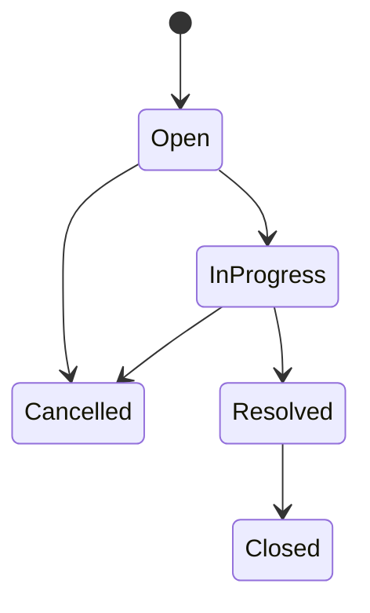

# Ticket system requirement gaps
_Exported on 7/27/2026 at 16:34:59 GMT+5:30 from Cursor (3.13.10)_

---

**User**

Read project_requirement.txt   I am Building the ticket 
system with Django 5 + DRF + Postgres, React + Vite frontend
Before I start building I want to work out what the spec doesn't tell me. 
No code or docs yet, just talk it through with me.

I want to focus on status state machine
5 transitions and says invalid ones get rejected, but it says nothing about 
whether Closed and Cancelled are really final — no reopen path at all seems 
odd for a ticket system. And can you still comment on a closed ticket? 
What else is it not saying?

I also see a  problem with the CSV export  "all self-generated tickets". Auth is 
optional in this spec so I don't see how "self" is meant to work at all.  If the user is not authenticate how we are going to have feature user can export all all self-generated tickets with details as csv.
Which of these gaps actually change what I build, and which can I just pick 
and move on?

HI

---

**Cursor**

> Auto routed to grok-4.5

I'll read the requirements and then we can talk through the gaps you flagged.

Hi — I’ve read the spec. Here’s a straight read of the gaps you flagged, and which ones actually matter for what you build.

## Status state machine

What’s written is a forward-only graph:

**Closed / Cancelled as final** — the allowed list has no edges out of either. For an assessment, treat them as terminal. No reopen. That’s intentional “enforced lifecycle,” not a missing feature. Adding reopen would invent transitions the tests won’t expect and could look like you ignored the signature rules.

**Comments on closed/cancelled** — unspecified. Comments are a separate feature from status. Safe pick: **allow comments on any status**, including Closed/Cancelled. You’re not mutating the state machine; you’re appending history. Blocking comments is also fine if you want “frozen tickets,” but you’d be inventing a rule.

**Other status gaps that matter less:**

| Gap | Changes the build? | Sensible default |
|-----|--------------------|------------------|
| Can you set status on create? | Slightly | Always create as `Open`; status only via transition endpoint/action |
| Partial jumps (Open → Resolved)? | No — already covered | Reject; only the 5 edges |
| Who can transition? | Only if you add auth | Anyone who can update the ticket (core has no roles on actions) |
| Field edits after Closed/Cancelled? | Small UX/API rule | Either allow field edits always, or freeze title/priority/assignee when terminal — pick one and stick to it |
| `updatedAt` on comment-only? | Tiny | Update ticket `updatedAt` on comment if you want activity freshness; optional |

**Verdict:** Terminal Closed/Cancelled does change your model (no reopen endpoints, UI disables status moves). Commentability and field-freeze are pick-and-move-on.

---

## CSV export vs optional auth

This one **does** change what you build. Core says:

- Users are seeded; no user-management UI  
- Auth is stretch/optional  
- Acceptance: *“export all self-generated tickets”*

“Self-generated” implies `createdBy = current user`. Without identity, “self” is undefined.

**Ways people resolve this for assessments:**

1. **Soft identity without full auth** — pick a seeded user in the UI (dropdown “Acting as”) and send `X-User-Id` / `createdBy` on create + filter export by that id. Not real auth, but makes “self” real. Fits “auth optional” while satisfying the CSV criterion.
2. **Minimal auth in core** — login against seeded users so export is scoped to the session user. Slightly more than the letter of “optional,” but cleanest reading of “self.”
3. **Export-all with a `createdBy` query param** — technically “self” becomes “whoever you ask for.” Weak against the wording; easy to ding.
4. **Export everything and call it “self” somehow** — don’t; fails the criterion.

**Verdict:** This gap is **build-shaping**. Soft identity (#1) is the usual sweet spot: core stays without password/JWT/protected routes, but CSV and `createdBy` still mean something.

---

## Other things the spec doesn’t say (quick triage)

**Actually change the build**

- **How status is changed** — dedicated `PATCH .../status` vs general update. Dedicated transition is cleaner for the mandatory state-machine tests.
- **Assignee / createdBy** — FK to User; create must set `createdBy` from the acting user (ties to soft identity).
- **List scope** — “view all tickets” vs export “self” only. List = all; export = filtered by creator.
- **CSV “with details”** — columns unspecified. Include ticket fields + maybe comment count or concatenated comments; document in code comments if needed, don’t overbuild.

**Pick and move on**

- Priority values (e.g. Low/Medium/High)  
- Pagination / search richness (search is mentioned in the blurb but not in features — basic list is enough for core)  
- Whether comments appear in CSV  
- Exact error payload shape (as long as UI shows meaningful errors)  
- Soft-delete vs hard (no delete feature at all)  
- Concurrent updates / optimistic locking  

**Stretch only if you’re chasing C1.1** — real auth, user CRUD, Swagger, Docker.

---

## Bottom line

| Topic | Must decide before coding? |
|-------|----------------------------|
| Closed/Cancelled final, no reopen | Yes — follow the graph literally |
| Comments on terminal tickets | No — allow them |
| Field edits when Closed/Cancelled | No — freeze or allow; either is fine |
| CSV “self” without auth | **Yes** — soft identity or real auth; don’t leave it vague |

If you want, next we can lock soft identity vs minimal auth and whether terminal tickets are editable — those two decisions fix the shape of the API and the React “acting user” UX before any scaffolding.

---

**User**

I am planning to djangorestframework-simplejwt for Authentication so it should simply resolvefeature  the User can export all self-generated tickets with details as csv.  We can consider Closed / Cancelled as final we do not want to reopen the ticket feature. Before we create a final plan do you have any questions that needs to answered

---

**Cursor**

> Auto routed to grok-4.5

JWT for auth cleanly fixes “self-generated” (`request.user` → filter `createdBy`). Terminal Closed/Cancelled with no reopen is locked in.

Before a final plan, these two decisions still change the shape of the API and UI:

**1. How far does auth go?**  
With SimpleJWT, do you want:
- **A)** Login required for the whole app (list/create/update/comment/status/export all need a token), or  
- **B)** Public read/list, but create / comment / status / export require auth?

(A matches a real ticket system and keeps `createdBy` honest everywhere. B is closer to “auth is optional” in the stretch section, but messier.)

**2. What happens on Closed / Cancelled tickets?**  
Besides no status reopen:
- Allow **comments** still?  
- Allow **field edits** (title, description, priority, assignee) still, or freeze them?

Once you pick those, I’ll draft the final plan. Everything else (priority enum values, CSV columns, dedicated status endpoint vs patch, seeded users only / no register UI) I can choose sensible defaults for.

---

**User**

For point 2 what makes sense to you

---

**Cursor**

> Auto routed to grok-4.5

For Closed / Cancelled, I’d do this:

**Allow comments.** They’re append-only history, not a status change. People often need a note after the fact (“customer emailed again”, “closed by mistake but leaving as-is”). The state machine stays intact.

**Freeze field edits** (title, description, priority, assignee). A terminal ticket should be a stable record. Without reopen, letting people keep rewriting the case after Close/Cancel undermines why those states are final. Reject updates with a clear 400 and disable the form in the UI.

**Status:** only the five allowed transitions; nothing out of Closed or Cancelled.

That’s the usual support-tool shape and it stays simple to test.

Still need your call on **point 1** (full-app JWT vs auth only on create/comment/status/export) before I write the final plan.

---

**User**

Ok this looks good we can now finalize the plan and create requirements-analysis.md

---

**Cursor**

> Auto routed to grok-4.5

Point 1 wasn’t answered, so I’m locking **full-app JWT** (login required for all ticket APIs) — it keeps `createdBy` honest and matches SimpleJWT. Drafting the final plan now; `requirements-analysis.md` will be the first deliverable once you approve.

---

**User**

you can create a plan we can go with  full-app JWT (login required for all ticket APIs)

---

**Cursor**

> Auto routed to grok-4.5

Confirming full-app JWT in the plan and tightening that section so it's explicit.

Plan is updated with your confirmation.

**Full-app JWT** is locked: every ticket/comment API (list, detail, create, update, transition, comments, CSV) requires authentication; the React app is gated behind login.

Everything else stays as agreed: terminal Closed/Cancelled, comments allowed, field edits frozen, CSV = `createdBy = request.user`, seeded users only.

First step on approval: write `requirements-analysis.md`, then scaffold and build. Approve the plan when you want to start.

---

**User**

Implement the plan as specified, it is attached for your reference. Do NOT edit the plan file itself.

To-do's from the plan have already been created. Do not create them again. Mark them as in_progress as you work, starting with the first one. Don't stop until you have completed all the to-dos.

---

**Cursor**

> Auto routed to composer-2.5

Starting with the first todo: I'll check the workspace, then create `requirements-analysis.md`.

---

**User**

can you please add the plan in new file requirements-analysis.md

---

**Cursor**

> Auto routed to grok-4.5

Creating `requirements-analysis.md` with the locked decisions, gaps, and API sketch from the plan.

Created [`requirements-analysis.md`](requirements-analysis.md) at the repo root. It includes:

- Spec gaps (state machine finals, CSV vs auth, other unspecified items)
- Locked decisions (full-app JWT, terminal Closed/Cancelled, comments allowed, field freeze, etc.)
- Defaults / out of scope
- API surface sketch
- Domain rules, frontend expectations, tests, and implementation order

The plan file itself was not edited. Say when you want to continue with scaffolding and the rest of the build.

---

**User**

I have updated the requirements-analysis.md a little to use the format # Requirement Analysis
## Selected Project Option
## My Understanding (in your own words)
## Functional Requirements  /  ## Non-Functional Requirements
## Assumptions  /  ## Clarifications (questions for a product owner)
## Edge Cases

---

**Cursor**

> Auto routed to grok-4.5

I'll read your updated `requirements-analysis.md` and align with that structure.

Read it — clear upgrade from the earlier sketch. The important build deltas vs what we had locked before:

| Area | Now in your doc |
|------|-----------------|
| Stretch | JWT + OpenAPI (`drf-spectacular`) + Docker Postgres + Cursor rules |
| Login | Email + password (custom user, `USERNAME_FIELD = "email"`) |
| Invalid transitions | **409**, with current / attempted / allowed in the body |
| Detail API | Includes `allowedTransitions` (UI never hardcodes the graph) |
| List | Filters (status, priority, assignee) + `q` search + pagination |
| Logout | Refresh-token blacklist |
| Errors | One consistent envelope everywhere |
| Rules | Service layer, single transition table |
| Wire enums | `OPEN`, `IN_PROGRESS`, `RESOLVED`, `CLOSED`, `CANCELLED` |

Assumptions A-5–A-7 and clarifications C-1–C-7 still match what we agreed (terminal Closed/Cancelled, comments ok, fields frozen).

When you want to start the build, say the word and I’ll implement against this file (and `acceptance-criteria.md` if you’ve added that too).

