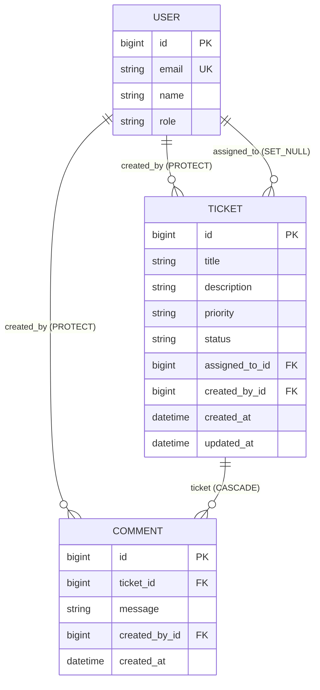

# Data Model — Support Ticket Management System

**Sources:** [`requirements_analysis.md`](requirements_analysis.md),
[`api_contract.md`](api_contract.md),
[`.cursor/rules/stack-and-conventions.mdc`](.cursor/rules/stack-and-conventions.mdc),
[`.cursor/rules/ticket-lifecycle.mdc`](.cursor/rules/ticket-lifecycle.mdc)

This document pins every column, FK, index, and constraint that should land in a
migration. Persistence target for Core is **SQLite** at
`BASE_DIR / "database" / "tickets.db"`, with engine/location from `DATABASE_URL`
only and the SQLite path resolved against `BASE_DIR` — not the process cwd
(A-22). Schema and constraints stay engine-portable so a later Postgres URL is
a config change, not a model rewrite. App layout assumed below:

| App | Models |
|-----|--------|
| `users` | `User` (custom) |
| `tickets` | `Ticket`, `Comment` |

App name is **`users`** everywhere (`AUTH_USER_MODEL = "users.User"`, table
`users_user`, migration dependencies). Do not use `accounts`.

---

## TextChoices (exact wire values)

From the lifecycle rule and API contract — stored and sent as these strings.

```python
class TicketStatus(models.TextChoices):
    OPEN = "OPEN", "Open"
    IN_PROGRESS = "IN_PROGRESS", "In Progress"
    RESOLVED = "RESOLVED", "Resolved"
    CLOSED = "CLOSED", "Closed"
    CANCELLED = "CANCELLED", "Cancelled"


class TicketPriority(models.TextChoices):
    LOW = "LOW", "Low"
    MEDIUM = "MEDIUM", "Medium"
    HIGH = "HIGH", "High"


class UserRole(models.TextChoices):
    AGENT = "AGENT", "Agent"
    ADMIN = "ADMIN", "Admin"
```

---

## Table: `users_user` (`User`)

Custom user. Extends `AbstractBaseUser` + `PermissionsMixin`.  
`USERNAME_FIELD = "email"`. **No `username` column.**

| Field | Django type | null | blank | max_length | default | choices | Note |
|-------|-------------|------|-------|------------|---------|---------|------|
| `id` | `BigAutoField` (PK) | no | — | — | auto | — | Django 5 default PK |
| `email` | `EmailField` | no | no | 254 | — | — | `USERNAME_FIELD`; unique |
| `name` | `CharField` | no | no | 150 | — | — | Display name from brief; 150 matches Django name-field habit |
| `role` | `CharField` | no | no | 20 | `AGENT` | `UserRole` (`AGENT`, `ADMIN`) | Stored and returned; Core does **not** gate on it (A-13) |
| `password` | `CharField` | no | no | 128 | — | — | From `AbstractBaseUser`; holds the hash, not plaintext |
| `is_active` | `BooleanField` | no | — | — | `True` | — | Required by Django auth |
| `is_staff` | `BooleanField` | no | — | — | `False` | — | From `PermissionsMixin`; needed for admin |
| `is_superuser` | `BooleanField` | no | — | — | `False` | — | From `PermissionsMixin` |
| `last_login` | `DateTimeField` | **yes** | yes | — | `null` | — | From `AbstractBaseUser` |
| `date_joined` | `DateTimeField` | no | — | — | `timezone.now` | — | Useful for seed/audit; not exposed as a product field |

**Manager:** custom `UserManager` with `create_user(email, password, **extra)` / `create_superuser(...)` — email required, no username arg.

**Meta:** `UNIQUE` on `email` (see constraints).

---

## Table: `tickets_ticket` (`Ticket`)

| Field | Django type | null | blank | max_length | default | choices | Note |
|-------|-------------|------|-------|------------|---------|---------|------|
| `id` | `BigAutoField` (PK) | no | — | — | auto | — | |
| `title` | `CharField` | no | no | **200** | — | — | Limit from `api_contract.md`; strip + min-1 enforced in service/serializer |
| `description` | `TextField` | no | no | — (DB) | — | — | No DB `max_length`. Cap **5000** in the serializer (`api_contract.md`). `TextField` → textarea in admin; portable across SQLite and a later Postgres switch |
| `priority` | `CharField` | no | no | 10 | — | `TicketPriority` (`LOW`, `MEDIUM`, `HIGH`) | Required on create; no DB default — client must send it |
| `status` | `CharField` | no | no | 20 | **`OPEN`** | `TicketStatus` (`OPEN`, `IN_PROGRESS`, `RESOLVED`, `CLOSED`, `CANCELLED`) | Always `OPEN` on create (A-8); only transition endpoint may change it |
| `assigned_to` | `ForeignKey(User)` | **yes** | yes | — | `null` | — | Optional / untriaged (C-6). See FK table |
| `created_by` | `ForeignKey(User)` | no | no | — | — | — | Set from `request.user` only (FR-9). See FK table |
| `created_at` | `DateTimeField` | no | — | — | `auto_now_add=True` | — | Default list sort `-created_at` (A-17) |
| `updated_at` | `DateTimeField` | no | — | — | `auto_now=True` | — | Touched on field update and status transition |

`related_name` suggestions: `created_by` → `tickets_created`, `assigned_to` → `tickets_assigned`.  
**Meta:** `ordering = ["-created_at"]` — matches list default (A-17).

---

## Table: `tickets_comment` (`Comment`)

| Field | Django type | null | blank | max_length | default | choices | Note |
|-------|-------------|------|-------|------------|---------|---------|------|
| `id` | `BigAutoField` (PK) | no | — | — | auto | — | |
| `ticket` | `ForeignKey(Ticket)` | no | no | — | — | — | Parent ticket. See FK table |
| `message` | `TextField` | no | no | — (DB) | — | — | No DB `max_length`. Cap **2000** in the serializer (`api_contract.md`). Same rationale as `Ticket.description` |
| `created_by` | `ForeignKey(User)` | no | no | — | — | — | From `request.user` (FR-28). See FK table |
| `created_at` | `DateTimeField` | no | — | — | `auto_now_add=True` | — | Append-only; no `updated_at` |

`related_name` on `ticket`: `comments`.  
**Meta:** `ordering = ["-created_at"]` — newest comment first when nested on ticket detail (and any queryset that does not override order).  
No edit/delete columns or soft-delete flag (A-19, FR-29).

---

## 1. Foreign keys and `on_delete`

| FK | `on_delete` | null | Reason |
|----|-------------|------|--------|
| `Ticket.created_by` → `User` | **`PROTECT`** | no | Deleting a user must not destroy ticket history (edge case in requirements). Creator is a permanent attribution. |
| `Ticket.assigned_to` → `User` | **`SET_NULL`** | **yes** | Ticket may be untriaged; a departing assignee must not delete or block deletion of tickets — assignment clears to `null`. |
| `Comment.ticket` → `Ticket` | **`CASCADE`** | no | A comment has no meaning without its ticket. (No ticket-delete feature in Core, but if one is ever added, orphans should not remain.) |
| `Comment.created_by` → `User` | **`PROTECT`** | no | See argument below. |

### `Comment.created_by` — choice and argument

**Recommendation: `PROTECT` (not `SET_NULL`, not `CASCADE`).**

| Option | Effect | Verdict |
|--------|--------|---------|
| `CASCADE` | Deleting a user deletes their comments | Reject. Comments are append-only history; cascading would silently erase evidence of who said what. |
| `SET_NULL` | Comment survives, author becomes `null` | Reject for Core. Authorship is part of the comment record the UI shows; nullable `created_by` forces “unknown author” everywhere and diverges from `Ticket.created_by`. |
| `PROTECT` | User delete fails while comments exist | **Accept.** Same rule as `Ticket.created_by`: identity that authored durable records is protected. Seeded-only users make deletes rare; when needed, an operator must reassign/anonymize deliberately. |

I agree with your three stated choices (`Ticket.created_by` PROTECT, `Ticket.assigned_to` SET_NULL, `Comment.ticket` CASCADE). No disagreement.

---

## 2. Custom user model — first migration and why `AUTH_USER_MODEL` freezes

### What goes wrong if you migrate first, swap later

Django’s first `migrate` creates `auth_user` (or whatever `AUTH_USER_MODEL` points at) and wires every built-in FK (`admin`, `auth` permissions, sessions content types, etc.) to that table. If you later change `AUTH_USER_MODEL`:

- Existing tables and FKs still point at the old user table.
- New apps’ FKs point at the new model.
- There is no safe, automatic “swap user table” migration. You are into data copying, `RunPython`, and often a reset database.

So: **`AUTH_USER_MODEL` must be set before the first `migrate` on an empty database, and then treated as immutable for the life of that DB.**

### Order of operations (empty project)

1. `django-admin startproject` / create settings — **do not run `migrate` yet**.
2. `startapp users` and define `User` (`AbstractBaseUser` + `PermissionsMixin`, `USERNAME_FIELD = "email"`, no `username`).
3. In settings: `AUTH_USER_MODEL = "users.User"`.
4. **Now** run `migrate` — Django creates `users_user` (and auth/admin tables referencing it), not `auth_user`.
5. `startapp tickets`, define `Ticket` / `Comment` with FKs to `settings.AUTH_USER_MODEL` (or `"users.User"`).
6. `makemigrations tickets` && `migrate` — ticket FKs resolve to the custom user table that already exists.

### Why email-as-username needs a custom manager early

`AbstractBaseUser` does not ship `create_user(email=...)`. Without a custom manager, `createsuperuser` and seeds look for `username`. The manager belongs in the **same first migration** as the model so seed commands and admin never assume a username column.

---

## 3. Indexes (only queries we actually run)

Django adds a DB index on every `ForeignKey` by default (`db_index=True`). Those are listed so the migration picture is complete; do not add a second manual index on the same column.

| Index | Serves this query |
|-------|-------------------|
| `tickets_ticket(status)` | `GET /api/tickets/?status=…` |
| `tickets_ticket(priority)` | `GET /api/tickets/?priority=…` |
| `tickets_ticket(assigned_to_id)` | `GET /api/tickets/?assigned_to=…` (FK default index) |
| `tickets_ticket(created_by_id)` | `GET /api/tickets/export/` — `WHERE created_by_id = request.user` (FK default index) |
| `tickets_ticket(created_at)` | Default list/export order `-created_at` (A-17). `models.Index(fields=["created_at"])` — SQLite (and Postgres) can use a plain btree for `ORDER BY created_at DESC`, so a descending index is unnecessary |
| `tickets_comment(ticket_id)` | Detail / comment create — load comments for a ticket (FK default index) |
| `tickets_comment(created_by_id)` | FK default only; no list filter by comment author in Core |

### Explicitly **not** indexed

| Column | Why not |
|--------|---------|
| `title`, `description` | `q` uses `icontains` (A-18). B-tree indexes are not used for `LIKE '%…%'`. Trigram / full-text is the upgrade path, not built now. Adding a btree would not serve the query. |

No composite indexes for Core at seed scale — list filters do combine
(`?status=…&priority=…&assigned_to=…&q=…`), but single-column indexes still
cover each predicate and the planner can combine them. The one composite that would
help later is `(created_by_id, created_at)` for the export query
(`WHERE created_by_id = ? ORDER BY created_at DESC`); skip it until that path
shows up in real volume.

---

## 4. Constraints

### UniqueConstraint / unique

| Constraint | On | Why |
|------------|----|-----|
| `UNIQUE (email)` | `User.email` | Required for `USERNAME_FIELD`; login identity must be unique |

### CheckConstraint

| Constraint | Expression (conceptually) | Why |
|------------|----------------------------|-----|
| `ticket_status_valid` | `status IN ('OPEN','IN_PROGRESS','RESOLVED','CLOSED','CANCELLED')` | DB-level guard so raw SQL / future callers cannot store a non-enum string; matches `TicketStatus` |
| `ticket_priority_valid` | `priority IN ('LOW','MEDIUM','HIGH')` | Same for priority |
| `user_role_valid` | `role IN ('AGENT','ADMIN')` | Same for role |

`TextChoices` / `choices=` alone creates **no** database constraint — only app-level validation. These checks are kept for real DB protection. **SQLite does enforce `CHECK` constraints** (as does Postgres), so this is not a Postgres-only feature.

**Migration cost is not free:** adding or renaming a value means a migration that drops and recreates the check. We accept that cost for the integrity win; we are not claiming checks are cheaper to evolve than native enum types.

Not adding a check that encodes the transition graph — that is application/service-layer authority (NFR-2, NFR-4), not a row constraint.

No uniqueness on `(ticket, message)` or similar — duplicate comments are allowed.

---

## 5. Relationship diagram



Text form:

```text
User 1 ──< Ticket.created_by     (PROTECT, required)
User 1 ──< Ticket.assigned_to    (SET_NULL, optional)
User 1 ──< Comment.created_by    (PROTECT, required)
Ticket 1 ──< Comment.ticket      (CASCADE, required)
```

---

## 6. Migration order

| Step | App | Why first / next |
|------|-----|------------------|
| 1 | **`users`** | Custom `User` must exist before any FK can point at it. `AUTH_USER_MODEL` is already set; this is the first app migration after Django’s own. |
| 2 | Django builtins (`admin`, `auth`, `contenttypes`, `sessions`, …) | Created by the initial `migrate` against the custom user; they depend on `users.User`. |
| 3 | **`tickets`** | `Ticket` and `Comment` FK to `users.User`. Generate only after `users` migrations exist so `makemigrations` resolves `AUTH_USER_MODEL`. |
| 4 | Token blacklist (SimpleJWT) | After auth user exists; blacklist tables reference the outstanding token flow, not our domain FKs, but still belong after the user model is live. |

**Rule of thumb:** never `makemigrations` / `migrate` for `tickets` until `users.0001_initial` (custom user) is in place.

Dependency in `tickets/migrations/0001_*.py` should include:

```python
dependencies = [
    migrations.swappable_dependency(settings.AUTH_USER_MODEL),
    # or ("users", "0001_initial"),
]
```

---

## 7. Considered and rejected

### Native database `ENUM` types (e.g. PostgreSQL `ENUM`)

**Rejected in favour of `CharField` + `TextChoices` + `CheckConstraint`.**

- We run on **SQLite** now (`BASE_DIR / "database" / "tickets.db"` via
  `DATABASE_URL` + `BASE_DIR` resolution). SQLite has no native ENUM type; a
  Postgres-only ENUM would block the one-env-var engine switch and force
  divergent schemas.
- What we actually prefer: plain `text`/`varchar` columns that speak the API’s uppercase strings with no cast layer, and Django/`TextChoices` as the app-side source of truth for serializers and forms — portable across SQLite today and Postgres later.
- **SQLite does support `CHECK` constraints**, and Django’s `CheckConstraint` maps to them. Checks still add value Django `choices` does not: they stop invalid values at the DB even for raw SQL. We keep them knowing they share the same “change the set → write a migration” cost as native enums.
- A-14 recorded the wire-format choice (uppercase `TextChoices` strings), not a claim that checks are free to evolve.

### `ticket_status_history` table

**Rejected for Core; current `Ticket.status` only (C-5).**

- The brief’s `Ticket` entity has a single `status` field and does not ask for history.
- Transition enforcement and tests need the **current** state and the allow-list, not an audit log.
- Adding history now means extra write path on every transition, more serializers/UI, and scope beyond the acceptance criteria.
- Recorded as a deliberate future improvement: who moved a ticket and when is useful, but not required to ship Core.

---

## Implementation checklist (when coding starts)

- [ ] `AUTH_USER_MODEL = "users.User"` before any migrate
- [ ] `User` with email `USERNAME_FIELD`, no username field, custom manager
- [ ] `Ticket` / `Comment` FKs and `on_delete` exactly as §1
- [ ] `description` and `message` as `TextField`; enforce 5000 / 2000 in serializers, not the model
- [ ] Indexes in §3 only — no btree on title/description for `q`
- [ ] Unique email + check constraints in §4
- [ ] Transition allow-list lives in one Python constant/table in the service layer — **not** duplicated in the DB schema
