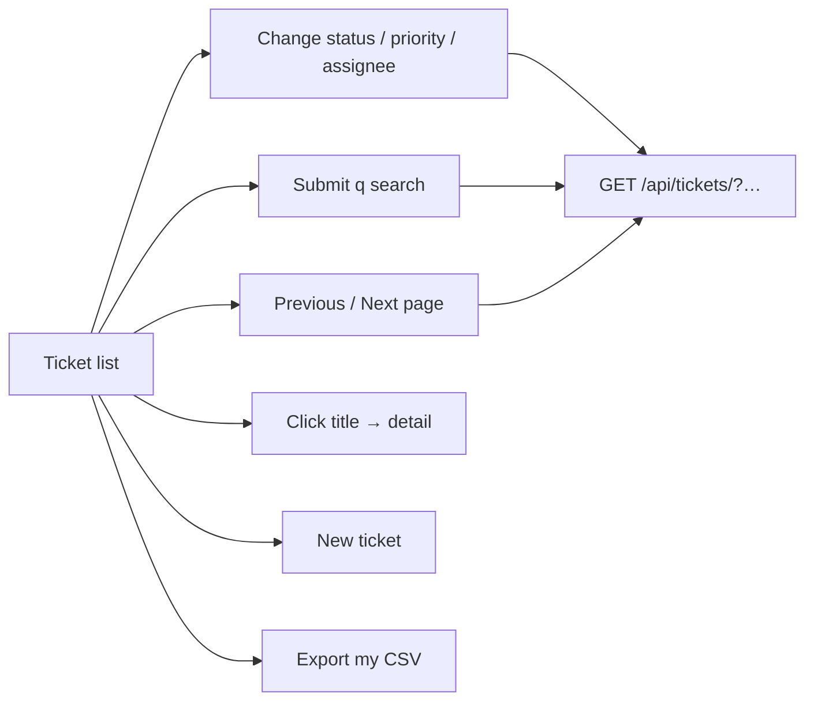
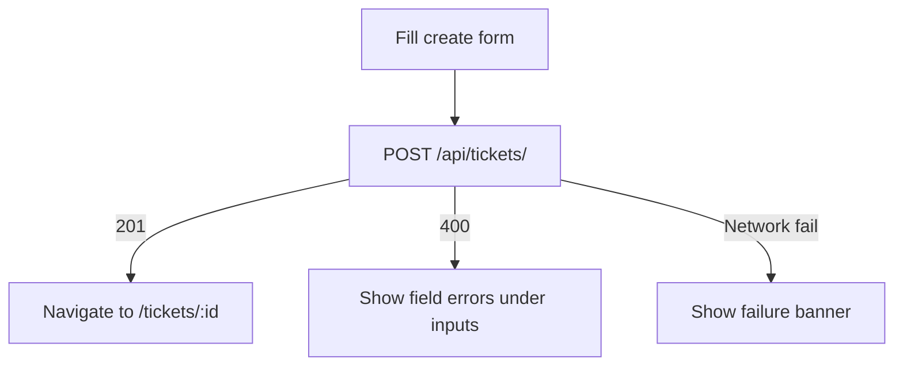
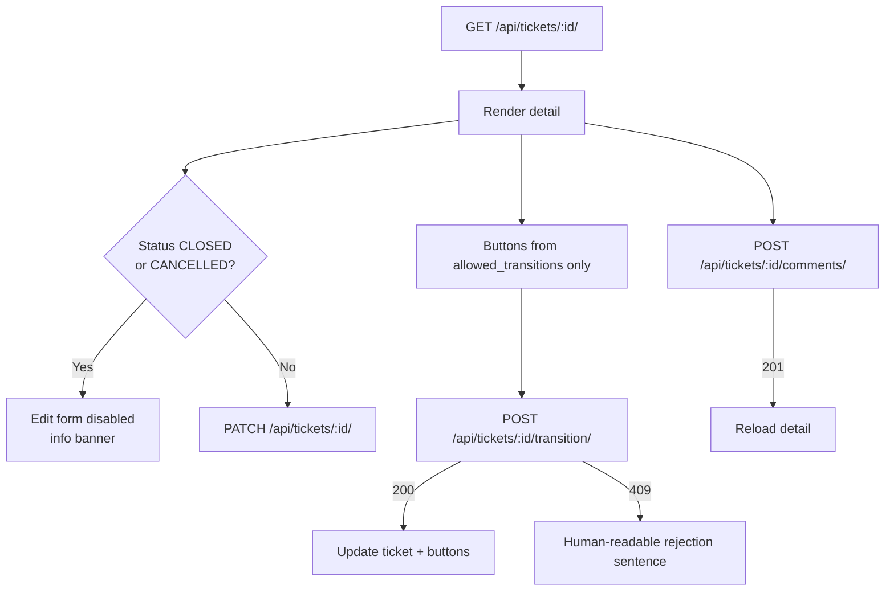
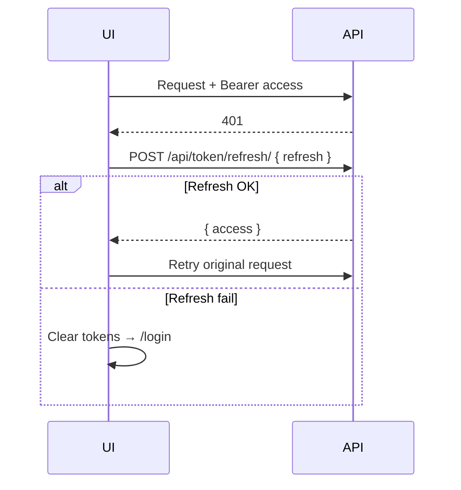

# UI Flow — Support Ticket Management

Frontend lives under `src/frontend/` (React + Vite + TypeScript). All ticket
routes require JWT auth. The API is the source of truth for validation and
allowed status transitions.

**Base URL (dev):** `http://localhost:5173/`  
**API (proxied):** `/api` → `http://127.0.0.1:8000`

---

## Route map

```
/login                 Public — sign in
/                      → redirect to /tickets
/tickets               Protected — list / filter / search / export
/tickets/new           Protected — create ticket
/tickets/:id           Protected — detail, edit, transition, comments
*                      → redirect to /tickets (then login if unauthenticated)
```

---

## High-level flow

```mermaid
flowchart TD
  Start([Open app]) --> AuthCheck{Refresh token<br/>in localStorage?}
  AuthCheck -->|No| Login[/login]
  AuthCheck -->|Yes| Refresh[Refresh access token]
  Refresh -->|OK| Tickets[/tickets]
  Refresh -->|Fail| Login

  Login -->|email + password| Tokens[Store access in memory<br/>refresh in localStorage]
  Tokens --> Tickets

  Tickets --> Create[/tickets/new]
  Tickets --> Detail[/tickets/:id]
  Tickets --> Export[Download my CSV]
  Create -->|201| Detail
  Detail --> Tickets

  Tickets --> Logout[Log out]
  Detail --> Logout
  Logout --> Blacklist[Blacklist refresh] --> Login

  API401[Any API 401] --> TryRefresh{One refresh + retry}
  TryRefresh -->|OK| Retry[Retry original request]
  TryRefresh -->|Fail| Login
```

---

## Screens

### 1. Login (`/login`)

**Entry:** Unauthenticated visit to any protected route, expired session after
failed refresh, or explicit logout.

| Step | User action | System behaviour |
|------|-------------|------------------|
| 1 | Enter email + password | Client validates required fields locally |
| 2 | Submit | `POST /api/token/` with `{ email, password }` |
| 3a | Success | Access → memory; refresh → `localStorage`; load `GET /api/me/`; navigate to `/tickets` (or prior deep link) |
| 3b | Failure | Show banner / field errors from API envelope; stay on login |

Already authenticated users hitting `/login` are redirected to `/tickets`.

**Demo accounts** (password = `SEED_PASSWORD` from `.env`, e.g. `SeedPass!23`):

- `priya.nair@example.com`
- `james.okonkwo@example.com`
- `sara.chen@example.com`

---

### 2. Ticket list (`/tickets`)

**Purpose:** Browse all tickets, filter/search, open detail, export own CSV.



| Control | API |
|---------|-----|
| Status / priority / assignee filters | `GET /api/tickets/?status=&priority=&assigned_to=&page=` |
| Search | `GET /api/tickets/?q=` (title or description) |
| Pagination | `page` (default page size 20) |
| Export my CSV | `GET /api/tickets/export/` → browser download `my-tickets.csv` |
| New ticket | Navigate to `/tickets/new` |

**Visible states (FR-38):**

| State | When |
|-------|------|
| Loading | Request in flight |
| Empty | `200` with zero results for current filters |
| Network / API failure | Distinct error banner (not treated as empty) |

Assignee dropdown is filled from `GET /api/users/`.

---

### 3. Create ticket (`/tickets/new`)

**Purpose:** Create a ticket; status is always `OPEN` on the server (no status
field in the form).

| Field | Required | Notes |
|-------|----------|-------|
| Title | Yes | Max 200 |
| Description | Yes | Max 5000 |
| Priority | Yes | `LOW` / `MEDIUM` / `HIGH` |
| Assignee | No | From `GET /api/users/`; omit / empty → unassigned |



`created_by` is never sent by the client; the API sets it from the authenticated
user.

---

### 4. Ticket detail (`/tickets/:id`)

**Purpose:** View full ticket + comments; edit fields; transition status; add
comments.



#### Edit fields

- Editable: title, description, priority, assignee
- **Not** editable via this form: status (dedicated transition actions only)
- On `CLOSED` / `CANCELLED`: form controls disabled; save button disabled
- `400` → inline field errors; other errors → banner

#### Status transitions (NFR-3)

- Buttons rendered **only** from response `allowed_transitions`
- Empty array → “No transitions available (terminal status)”
- Frontend never hardcodes the allow-list
- Rejected transition (`409`) shown as a sentence, e.g. current → attempted and
  allowed alternatives (FR-37)

#### Comments

- Allowed in **any** status, including terminal
- Append-only (no edit/delete in UI)
- List ordered newest-first (as returned by API)
- After post, detail is re-fetched so the thread stays in sync

---

## Auth token lifecycle

| Token | Storage | Lifetime handling |
|-------|---------|-------------------|
| Access | In-memory only | On `401`, one refresh + retry |
| Refresh | `localStorage` (`refresh_token`) | Used at bootstrap and on 401; blacklisted on logout |



Logout: `POST /api/token/blacklist/` with refresh (best-effort), clear tokens,
navigate to `/login`.

---

## Error UX mapping

| API outcome | UI |
|-------------|----|
| `400` + `error.details` field map | Inline message under the field (FR-36) |
| `409` invalid transition | Banner with human-readable sentence (FR-37) |
| `409` terminal field freeze | Form already disabled; banner if update attempted |
| Network failure | Distinct failure banner / state (FR-38) |
| `401` after failed refresh | Redirect to `/login` |

All errors use the shared API envelope:
`{ error: { code, message, details } }`.

---

## Out of scope in the UI

- User registration / user CRUD
- Role-gated screens (role is shown/stored but does not gate Core actions)
- Hardcoded transition matrix
- Ticket or comment delete
- Changing status via the edit/PATCH form
